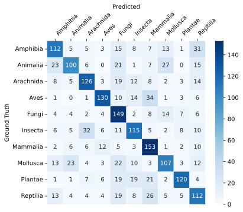
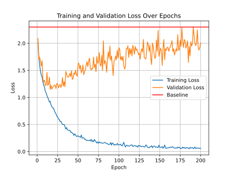

# A DNN Approach to Flora and Fauna Image Classification



In this repository we fine tune the ResNet50 to the [Flora and Fauna](https://www.kaggle.com/datasets/advaitkisar/flora-and-fauna-dataset) dataset from kaggle. Above is the confusion heatmap from our best model is shown. The best model on kaggle was at 27.96% accuracy, with our fine tuning we where able to excede that accuracy to 61.20%.  

The dataset consists of 10 classes of which 6 are animal groups (mammals, birds, reptiles, amphibians, molluscs, sea animals), one plant, one fungus, one insect and one arachnid group.
Per class there are 1,000 Images provided in the train set and an aditional 200 in the test set. The test set is left unchanged, but the train set we randomly split into 90% train and 10% validation data. The training of our best model consisted of augmentation (random crop, resize, random flip and color jitter). We used the cross entropy loss and the adam optimizer with $\alpha = 0.001$. We trained on a NVIDIA A100 graphicscard for 100 epochs.



From the plot above we see, that afer 15-20 epochs our model beginns to overfit our data, so a shorter training time would have givn us simmilar results. The baseline is the model that always predicts the same class and is there for refference.


## Enviroment

Create the vituel enviroment for this repository: 
```bash
conda create env python=3.11
```

Activate the virtual enviroment:
```bash
conda activate env
```

Install the needed packages in your enviroment:

```bash
pip3 install torch torchvision --index-url https://download.pytorch.org/whl/cu126
```


## Training

For regular training with just center crop:

```bash
python train.py
```

For training with augmentation (random crop, resize, color jitter):

```bash
python train_with_aug.py
```

## Testing

For testing exchange the first argument for the path to your models weights, second argument is the name the results will be saved to:
```bash
python test.py .\training_with_augmentation\best_model.pth test_test.csv
```

## Validation

Validation can be found in validation.ipynb.
Results where shown in the beginning of the README.